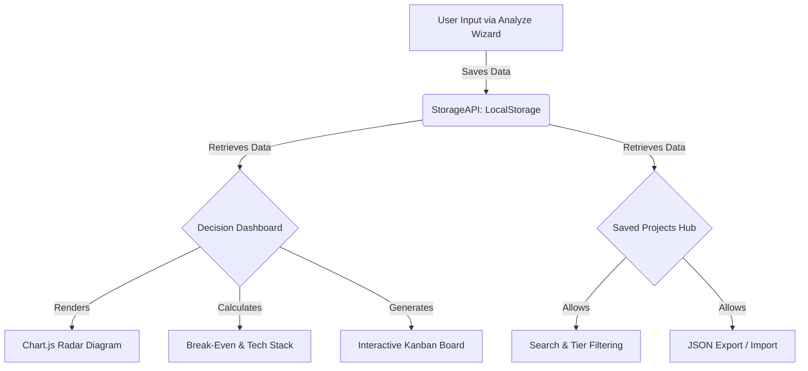

# 🚀 Project Validator AI

<div align="center">
  <h3>Stop building generic tutorials. Build startup-ready projects.</h3>
  <p>The ultimate framework to analyze feasibility, technical depth, resume impact, and startup potential before writing a single line of code.</p>
</div>

---

## 🌟 Overview

**Project Validator AI** is a premium, serverless web application that helps developers and founders evaluate their project ideas. Instead of jumping blindly into coding, use this tool to score your idea across Market, Technical, and Financial dimensions. 

Built with a stunning **Deep Onyx & Neon Glow** aesthetic, this tool utilizes advanced glassmorphism and fully persistent local storage to act as your personal "Startup Idea Hub".

## ✨ Key Features

- 🧙 **Multi-Step Analysis Wizard**: A smooth, 5-step interactive form to capture project concepts, technical stack, competitors, and financial projections.
- 📊 **Dynamic Radar Charts**: Instantly visualize your project's strengths and weaknesses (Innovation, Scalability, Market Need, etc.) using beautifully rendered `Chart.js` radar diagrams.
- 📋 **Interactive MVP Kanban Board**: The system auto-generates a 10-phase execution plan. Use the built-in drag-and-drop Kanban board (To Do, In Progress, Done) to actively track your project's build.
- 💰 **Monetization & Break-Even Calculator**: Input your server costs and SaaS pricing to automatically calculate how many paid users you need to break even.
- 🧠 **Tech Stack Recommender**: Auto-suggests the ideal modern tech stack (e.g., Next.js, Supabase, Solidity) based on your domain and deployment target.
- 🔥 **"Roast My Idea" AI Mode**: Get brutally honest, dynamic feedback on your project based on your scorecard metrics.
- 💾 **100% Serverless & Persistent**: All project data is securely saved to your browser's `localStorage`. Export and import your data anytime via `.json` backups.
- 📄 **PDF Export**: Generate professional PDF reports of your project dashboard with a single click.

## 🛠 Tech Stack

- **Frontend**: HTML5, Vanilla JavaScript
- **Styling**: Tailwind CSS (compiled via CLI)
- **Data Visualization**: Chart.js
- **Icons**: Phosphor Icons
- **PDF Generation**: html2pdf.js
- **Storage**: Browser LocalStorage API

## 📐 Architecture & Data Flow



## 🎨 Design System

The application utilizes a custom **"Onyx & Neon Glow"** theme:
- **Background**: Deep Onyx / Zinc-950 (`#09090b`)
- **Primary Accent**: Neon Fuchsia (`#d946ef`)
- **Secondary Accent**: Electric Cyan (`#06b6d4`)
- **Surfaces**: Ultra-transparent frosted glass (`bg-white/[0.02]`) with tight, bright borders and dynamic animated drifting background lighting.

## 🚀 Getting Started

Since this project is completely serverless, no backend setup is required.

1. **Clone the repository:**
   ```bash
   git clone https://github.com/RishvinReddy/project-validation-system.git
   cd project-validation-system
   ```

2. **Install Tailwind dependencies:**
   ```bash
   npm install
   ```

3. **Compile CSS (if you make changes):**
   ```bash
   npm run build:css
   ```

4. **Run Locally:**
   Simply open `index.html` in your favorite modern browser. No dev server is strictly required, though you can use `Live Server` in VSCode for auto-reloading.

## 🤝 Contributing
Contributions, issues, and feature requests are welcome! Feel free to check the issues page.
